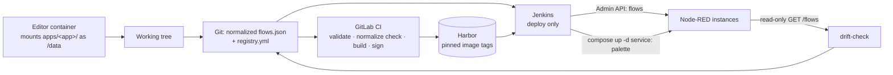

# Architecture — Node-RED multi-instance deployment

Status: target architecture, not yet built. Rationale and closed decisions: [`decisions.md`](decisions.md). Unresolved gaps and the commands that close them: [`open-questions.md`](open-questions.md).

## The problem

15 Node-RED runtimes across 10 servers. Flows are edited in the browser editor and today reach production by hand. There is no history, no review, and no way to tell what is running.

Measured, not assumed — `scripts/collect-inventory.py` visited every host:

| | |
|---|---|
| 6 servers with a dev/prod pair | `cho`, `gor`, `jan`, `slu`, `srem`, `wag` — 12 instances |
| 1 server with a single instance | `wfm-svr-lin01` — one `node-red`, and **no `adminAuth`** |
| 2 servers under FlowFuse | `pod-svr-lin01`, `dpn-svr-iot` — migration targets, see below |
| 1 server with no Node-RED at all | `foi-svr-lnx01` — NATS, iot-bridges, dashboards |

Two of those servers, `wfm-svr-lin01` and `dpn-svr-iot`, are absent from the Jenkins host map, which knows 8. The map is the input to the new pipeline, so it grows by two.

Topology is **not a fleet**: no two instances share a flow signature — the collector compared the node type and name multiset of every flow, ignoring ids and layout, and found no match. Every instance is its own application. `wag-svr-lin01` makes the point concretely: `node-red-prod` has 15 nodes and no palette, `node-red-test` has 222 nodes and two palette modules. A template-first system would be wrong, and there are no shared `apps/` directories to factor out.

The palette across the estate is wider than the first pair suggested: `node-red-contrib-opcua`, `node-red-contrib-postgresql`, `node-red-contrib-mssql-plus`, `node-red-contrib-queue-gate`, `node-red-dashboard`, `node-red-node-ui-table`, `node-red-contrib-ui-upload`, `@martip/node-red-xlsx`. Largest instance is `srem-svr-lin01/node-red-prod` at 205 nodes across 40 node types.

## The shape

Git is the source of truth. Two deployment transports, both versioned, neither silent:

| What changes | Transport | Frequency | Container restart |
|---|---|---|---|
| Flow logic | Node-RED Admin API `POST <admin_root>/flows` | daily | no |
| Palette modules (npm) | image rebuild + `docker compose up -d <service>` | rare | yes |

Splitting them is the point. Flow deploys are frequent, so they must not interrupt MQTT ingest. Palette deploys are rare, so a restart gap is acceptable there.



## Repository layout

```
apps/<app-name>/
  flows.json      normalized, editor-valid, no placeholders
  package.json    palette dependencies for this app
  Dockerfile      FROM base, COPY package.json, npm install
base/Dockerfile   pinned nodered/node-red:5.0.1-<variant>
compose/          per-instance compose fragments
registry.yml      instance inventory — see registry.md
schemas/          JSON Schema for registry.yml
scripts/
  normalize.py    canonicalize flows.json
  deploy.py       token → GET /flows → rev → POST /flows
  drift-check.py  read-only: running flows vs. Git
docs/             this directory
INVENTORY.md      inventory output, secrets stripped
```

One artifact per app; env vars parameterize it for N instances. A flow file in the repo always opens in the editor unchanged — that is what keeps the return path from editor to Git alive.

## Flow deploy sequence

`deploy.py` runs **on the target host**, not on the Jenkins agent. Jenkins ships it over the existing SSH hop and executes it there; from the host it reaches the instance by container IP on `app_network`. No instance publishes a port, and the site servers sit in separate subnets, so a central agent cannot reach a container directly — the host can.

SSH is a transport for the script, never a path for writing flow files. The `rev` handshake and the no-restart property are exactly what the Admin API is here for.

`scripts/deploy.py`, one instance at a time:

1. `POST <admin_root>/auth/token` → Bearer token. `adminAuth` is active on every instance (`type: credentials`, bcrypt), so every call needs one.
2. `GET <admin_root>/flows` → capture `rev`.
3. Render env vars. Optional Jinja2 pass **only** for composite strings such as `mqtt-${SITE}/events`, on a copy — Node-RED's own `${ENV}` substitution replaces whole properties only, so composites need help.
4. `POST <admin_root>/flows` with header `Node-RED-Deployment-Type: flows` and the captured `rev`.
5. `409` → abort. The running flow diverged from Git; that must surface as a red pipeline, never be flattened.

`--dry-run` prints the normalized diff and exits 0. `--instance <name>` targets one instance for a hotfix.

`admin_root` is per-instance (`/node-red-prod`, `/node-red-test`), so the API lives at `<base><admin_root>/flows` — never at `/flows`.

## CI split

Two systems, already wired in this repo, with different reach:

**GitLab CI** (`.gitlab-ci.yml`) — everything that needs no site access:
- registry.yml schema validation
- normalize check: fail if any committed `flows.json` differs from its normalized form
- external-module check: fail if any function node declares `"module":` (see below)
- image build via the `ci-cd-catalog/buildah` component, signed via `ci-cd-catalog/cosign`
- existing scan components (semgrep, trivy, hadolint) apply to the new Dockerfiles unchanged

**Jenkins** (`Jenkinsfile`) — deploy only, because it holds the per-host SSH credentials (`<host>_pw`) and the host/IP map, and because it is the only agent with network reach into the sites. Stages: dry-run diff → flow deploy → optional compose recreate for palette changes.

Compose calls are **service-scoped** — `docker compose up -d node-red-prod`. A bare `docker compose up -d` would recreate NATS and the other services that share `/home/administrator/base_container/docker-compose.yml`. Task: move the Node-RED services into their own compose project so that risk disappears structurally rather than by discipline (~1h, see [`runbook.md`](runbook.md)).

## Measured environment facts

Inventory ran on `wag-svr-lin01`, both containers. These are measured, not assumed.

That host was rebuilt in the week before the inventory, which makes it the current baseline rather than a box being decommissioned — and makes `node-red-prod`'s 15 nodes worth a second look. A freshly rebuilt host whose prod instance holds 15 nodes and no palette modules, while its test instance holds 226 nodes and two palette modules, reads more like a prod instance that has not been migrated back yet than like a small production application.

| Fact | Value | Consequence |
|---|---|---|
| Node-RED version | 5.0.1 | subflow modules, global env vars, `nodeDefaults` all available — no version-gated compromises |
| Image tag in use | `nodered/node-red:latest` | must be pinned; `latest` + `restart: always` drifts silently per host |
| `credentialSecret` | commented out | generated key exists only in `/data/.config.runtime.json`; single copy, in no backup |
| `flows_cred.json` | present on both | real credentials in use; undecryptable without that key file |
| `httpAdminRoot` | `/node-red-prod`, `/node-red-test` | API base path is per-instance |
| `adminAuth` | active, bcrypt | token call required before every API call |
| published ports | **mixed** | `cho`, `gor`, `jan` publish 1880/1881, `slu-test` 1882, `wfm` 1880; `wag`, `srem` and `slu-prod` publish nothing. Not a uniform property, so the deploy path cannot rely on one |
| `flowFilePretty` | `true` | flows already multi-line; the normalizer strips and sorts, it does not reformat |
| `contextStorage` | commented out | memory-only context; a recreate loses nothing but the restart gap |
| `functionExternalModules` | `true`, zero nodes using it | image baking is a real guarantee only while that stays zero — hence the CI check |
| compose location | shared `base_container/docker-compose.yml` | service-scoped compose calls until the split lands |

## Normalization

`normalize.py`: strip the positional keys `x`, `y`, `z`; sort nodes by `id`; stable key order; 2-space indent. Idempotent — a second run is a no-op. Round-trip safe — the output still imports into the editor.

Build and test this first, against both real flows (18 KB / 15 nodes, and 151 KB / 226 nodes). If the diffs are not readable by a human reviewer, the whole Git-as-source-of-truth approach fails at this step, and that is cheap to discover in an hour.

## FlowFuse instances

Two servers run their Node-RED under FlowFuse. They are a **migration source**, not a deployment target: FlowFuse gets no transport, no `registry.yml` entry and no pipeline stage. Each instance is exported once, lands in `apps/` as a normalized `flows.json`, comes up as a plain container, and from then on is an instance like any other.

That direction is the same decision the whole architecture rests on. FlowFuse is a control plane that owns the flows, which is the category decision 1 rejected — the reasoning does not change because the control plane is a good one.

Both run `flowfuse/device-agent:latest`, and the inventory found the decisive fact: the flow **is on disk**, at `/opt/flowfuse-device/project/flows.json`, with `flows_cred.json` beside it. Extraction is a file copy, not a platform export — the expensive version of this migration is off the table.

Two things that still need settling:

- **The credential key.** `flows_cred.json` exists, so credentials are in use and encrypted. The key lives in the device-agent's own configuration, not in `/data`. Whether it can be carried over decides between "copy two files" and "copy the flow and re-enter every credential by hand". Open question 3.
- **The device agent keeps syncing.** The file on disk is the agent's copy of what the platform holds; the platform stays the source of truth until the device is unenrolled. So the cutover order matters: copy the flow, stand up the plain container, unenroll, then retire the agent — otherwise the agent overwrites the file from the platform.

Palette is FlowFuse-managed: whatever it installs per project becomes that app's `apps/<app>/package.json`, which the image then bakes.

Sequencing: migrate a plain-container pair first. It proves normalize → commit → deploy end to end against the simpler case, and the FlowFuse cutover then only adds the export step to a path that already works.

## Visibility

There is no way to see, today, what is actually running on 16 instances. That gap is real and worth closing — as a **report**, not a control plane.

`drift-check.py` sweeps every instance, normalizes what it gets, diffs against Git, and emits JSON. CI renders that JSON into a static HTML page and publishes it. It answers the questions that matter — which instances match Git, which drifted, which flow version and image tag each one runs, when it was last deployed — and it answers them from Git plus a read-only sweep.

What it deliberately does not do is offer a button. Deploys go through the pipeline, where they are reviewed and recorded. A UI that writes is decision 1 rebuilt in a browser, and it brings back the database, the backend and the auth layer that the static page needs none of. See decision 11 in [`decisions.md`](decisions.md).

## Inherited from the project template

This repository was created from the company web-app template and originally held its whole stack. The FastAPI backend, the Vue 3 frontend, the Postgres compose file, the dev containers and the template's placeholder setup script have been removed — none of them serve this architecture.

Kept, because the new pipeline needs them:

- the `ci-cd-catalog` scan-component wiring in `.gitlab-ci.yml`, and the Harbor registry host
- the `Jenkinsfile`, which still holds the host map, the per-host credential ids and the `sshCommand` deploy pattern. It deploys the template's stack, not this one, and is replaced once the new pipeline exists — removing it earlier would delete the only record of that map.
