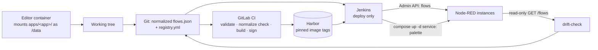

# Architecture — Node-RED multi-instance deployment

Status: target architecture, not yet built. Rationale and closed decisions: [`decisions.md`](decisions.md). Unresolved gaps and the commands that close them: [`open-questions.md`](open-questions.md).

## The problem

~20 Node-RED instances across ~8–10 site servers. Flows are edited in the browser editor and today reach production by hand. There is no history, no review, and no way to tell what is running.

Topology is **mixed**, not a fleet: a few instances share logic, most are one-offs. The measured pair on `wag-svr-lin01` proves it — `node-red-prod` has 15 nodes and no palette modules, `node-red-test` has 226 nodes and depends on `node-red-contrib-postgresql` and `node-red-contrib-queue-gate`. Those are two different applications that happen to share a host. A template-first system would be wrong.

## The shape

Git is the source of truth. Two deployment transports, both versioned, neither silent:

| What changes | Transport | Frequency | Container restart |
|---|---|---|---|
| Flow logic | Node-RED Admin API `POST <admin_root>/flows` | daily | no |
| Palette modules (npm) | image rebuild + `docker compose up -d <service>` | rare | yes |

Splitting them is the point. Flow deploys are frequent, so they must not interrupt MQTT ingest. Palette deploys are rare, so a restart gap is acceptable there.



## Repository layout

```
apps/<app-name>/
  flows.json      normalized, editor-valid, no placeholders
  package.json    palette dependencies for this app
  Dockerfile      FROM base, COPY package.json, npm install
base/Dockerfile   pinned nodered/node-red:5.0.1-<variant>
compose/          per-instance compose fragments
registry.yml      instance inventory — see registry.md
schemas/          JSON Schema for registry.yml
scripts/
  normalize.py    canonicalize flows.json
  deploy.py       token → GET /flows → rev → POST /flows
  drift-check.py  read-only: running flows vs. Git
docs/             this directory
INVENTORY.md      inventory output, secrets stripped
```

One artifact per app; env vars parameterize it for N instances. A flow file in the repo always opens in the editor unchanged — that is what keeps the return path from editor to Git alive.

## Flow deploy sequence

`scripts/deploy.py`, one instance at a time:

1. `POST <admin_root>/auth/token` → Bearer token. `adminAuth` is active on every instance (`type: credentials`, bcrypt), so every call needs one.
2. `GET <admin_root>/flows` → capture `rev`.
3. Render env vars. Optional Jinja2 pass **only** for composite strings such as `mqtt-${SITE}/events`, on a copy — Node-RED's own `${ENV}` substitution replaces whole properties only, so composites need help.
4. `POST <admin_root>/flows` with header `Node-RED-Deployment-Type: flows` and the captured `rev`.
5. `409` → abort. The running flow diverged from Git; that must surface as a red pipeline, never be flattened.

`--dry-run` prints the normalized diff and exits 0. `--instance <name>` targets one instance for a hotfix.

`admin_root` is per-instance (`/node-red-prod`, `/node-red-test`), so the API lives at `<base><admin_root>/flows` — never at `/flows`.

## CI split

Two systems, already wired in this repo, with different reach:

**GitLab CI** (`.gitlab-ci.yml`) — everything that needs no site access:
- registry.yml schema validation
- normalize check: fail if any committed `flows.json` differs from its normalized form
- external-module check: fail if any function node declares `"module":` (see below)
- image build via the `ci-cd-catalog/buildah` component, signed via `ci-cd-catalog/cosign`
- existing scan components (semgrep, trivy, hadolint) apply to the new Dockerfiles unchanged

**Jenkins** (`Jenkinsfile`) — deploy only, because it holds the per-host SSH credentials (`<host>_pw`) and the host/IP map. Stages: dry-run diff → flow deploy → optional compose recreate for palette changes.

Compose calls are **service-scoped** — `docker compose up -d node-red-prod`. A bare `docker compose up -d` would recreate NATS and the other services that share `/home/administrator/base_container/docker-compose.yml`. Task: move the Node-RED services into their own compose project so that risk disappears structurally rather than by discipline (~1h, see [`runbook.md`](runbook.md)).

## Measured environment facts

Inventory ran on `wag-svr-lin01`, both containers. These are measured, not assumed.

| Fact | Value | Consequence |
|---|---|---|
| Node-RED version | 5.0.1 | subflow modules, global env vars, `nodeDefaults` all available — no version-gated compromises |
| Image tag in use | `nodered/node-red:latest` | must be pinned; `latest` + `restart: always` drifts silently per host |
| `credentialSecret` | commented out | generated key exists only in `/data/.config.runtime.json`; single copy, in no backup |
| `flows_cred.json` | present on both | real credentials in use; undecryptable without that key file |
| `httpAdminRoot` | `/node-red-prod`, `/node-red-test` | API base path is per-instance |
| `adminAuth` | active, bcrypt | token call required before every API call |
| published ports | none | nginx does path-based routing; port allocation is a non-problem |
| `flowFilePretty` | `true` | flows already multi-line; the normalizer strips and sorts, it does not reformat |
| `contextStorage` | commented out | memory-only context; a recreate loses nothing but the restart gap |
| `functionExternalModules` | `true`, zero nodes using it | image baking is a real guarantee only while that stays zero — hence the CI check |
| compose location | shared `base_container/docker-compose.yml` | service-scoped compose calls until the split lands |

## Normalization

`normalize.py`: strip the positional keys `x`, `y`, `z`; sort nodes by `id`; stable key order; 2-space indent. Idempotent — a second run is a no-op. Round-trip safe — the output still imports into the editor.

Build and test this first, against both real flows (18 KB / 15 nodes, and 151 KB / 226 nodes). If the diffs are not readable by a human reviewer, the whole Git-as-source-of-truth approach fails at this step, and that is cheap to discover in an hour.

## What must change in this repository

This repo currently holds the unmodified company web-app template (FastAPI, Vue 3, Postgres, Alembic, `app_name = "dapnodered"`, placeholders still in `setup_project.py`). None of it serves this architecture — there is no backend, no database, and no UI in the target design.

Reusable as-is: the `ci-cd-catalog` component wiring in `.gitlab-ci.yml`, the Harbor registry host, and the Jenkins host map plus `sshCommand` deploy pattern in `Jenkinsfile`.

Everything else (`backend/`, `frontend/`, `.devcontainer/`, `docker-compose.dev.yml`, `setup_project.py`, `renovate.json`, `.env.example`, `README.md`) is template scaffolding for a stack this project does not use. Removing it is a destructive, one-way change — it is question 5 in [`open-questions.md`](open-questions.md), not something to do unasked.
